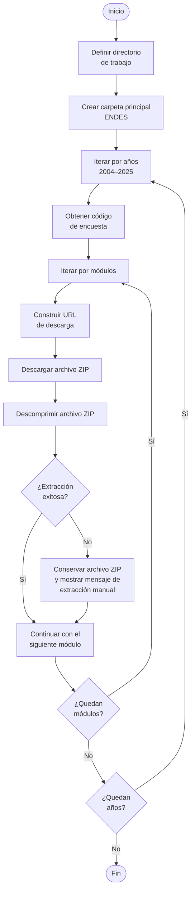

Script automatizado en Stata para descargar, organizar y extraer los módulos de la **Encuesta Demográfica y de Salud Familiar (ENDES)** del portal de [Microdatos](https://proyectos.inei.gob.pe/microdatos/) del INEI (2004–2025). Incluye gestión de módulos, extracción de archivos ZIP y una estructura reproducible para facilitar el procesamiento de datos.

<!--more-->

## 1. Requisitos ⚙️ <a id='1'></a>
Para ejecutar este proyecto únicamente se requiere:
- **Stata 16** o superior.
- Permisos de escritura en el directorio donde se almacenarán los archivos descargados.
- **Git** (opcional), para clonar el repositorio.

## 2. Instalación y uso 🚀 <a id='2'></a>

### 2.1. Clonar el repositorio

1. Abrir una terminal o línea de comandos Git Bash.

2. Ejecutar el siguiente comando para clonar el repositorio en tu máquina local:
```bash
git clone https://github.com/CarloEduardo/02-Web-Scraping-ENDES-2004-2025.git
```

3. Establecer como directorio de trabajo la carpeta clonada.
```
cd \E:\07. GitHub\02-Web-Scraping-ENDES-2004-2025\
```

### 2.2. Uso

1. Abrir el archivo 
```bash
Download-ENDES-2004-2025.do
```

2. Modificar la ruta donde se almacenarán los archivos descargados.
```stata
global Path = "E:\07. GitHub\02-Web-Scraping-ENDES-2004-2025"
```

3. Si lo deseas, modificar el rango de años:
```stata
local y_start = 4
local y_end   = 25
```

4. Seleccionar los módulos que deseas descargar:
```stata
foreach j in 1 2 3 4 5 {
```

5. Ejecutar el script.

## 3. Módulos disponibles <a id="3"></a>

| **Nro.** | **Módulo** | **Descripción** |
|---:|---|---|
| 1 | Módulo 1629 | Caracteristicas del Hogar |
| 2 | Módulo 1630 | Caracteristicas de la Vivienda	 |
| 3 | Módulo 1631 | Datos Basicos de MEF |
| 4 | Módulo 1632 | Historia de Nacimiento - Tabla de Conocimiento de Metodo |
| 5 | Módulo 1633 | Embarazo, Parto, Puerperio y Lactancia |
| 6 | Módulo 1634 | Inmunización y Salud |
| 7 | Módulo 1635 | Nupcialidad - Fecundidad - Cónyugue y Mujer |
| 8 | Módulo 1636 | Conocimiento de Sida y uso del condón |
| 9 | Módulo 1637 | Mortalidad Materna - Violencia Familiars |
| 10 | Módulo 1638 | Peso y talla - Anemia |
| 11 | Módulo 1639 | Disciplina Infantil |
| 12 | Módulo 1640 | Encuesta de salud	 |
| 13 | Módulo 1641 | Programas Sociales |


## 4. Funcionamiento del script <a id="4"></a>
El script realiza automáticamente las siguientes tareas:

1. Crea la estructura de carpetas del proyecto.
2. Recorre los años seleccionados.
3. Obtiene el Código de Encuesta correspondiente a cada año.
4. Recorre los módulos seleccionados.
5. Descarga cada archivo ZIP desde el portal oficial del INEI.
6. Descomprime automáticamente cada archivo.
7. Conserva el archivo ZIP cuando ocurre un error durante la extracción.

El proceso completo puede resumirse mediante el siguiente flujo:

El siguiente diagrama resume el flujo de ejecución del script para descargar y extraer automáticamente los módulos de la **Encuesta Demográfica y de Salud Familiar (ENDES)**:

# Flujo del proceso de descarga y extracción de la ENDES (2004–2025)


*Elaboración propia.* <br>
***Nota:** El diagrama muestra el flujo de ejecución del script, incluyendo la iteración por años y módulos, la construcción de la URL de descarga, la obtención de los archivos desde el portal oficial del INEI y su extracción automática. En caso de que un archivo comprimido presente inconsistencias, el script conserva el archivo `.zip` y notifica al usuario que la extracción debe realizarse manualmente.*

La siguiente figura muestra la interfaz del portal de Microdatos del INEI para la descarga de la ENDES. Se resaltan el año de la encuesta, el código de la encuesta y el código del módulo, que constituyen los parámetros utilizados por el script para construir automáticamente las URL de descarga de cada archivo.


## 5. Resultado 📂<a id="5"></a>
Al finalizar la ejecución se obtiene una estructura similar a la siguiente:

```text
ENDES/
│
├── 2004/
│   ├── RECH0.sav
│   ├── RECH1.sav
│   └── ...
│
├── 2005/
│   └── ...
│
├── ...
│
└── 2025/
    └── ...
```
Cada carpeta contiene todos los módulos descargados y extraídos para el año correspondiente.

## 6. Observaciones ⚠️<a id="6"></a>
En algunos años, determinados archivos ZIP publicados por el INEI presentan inconsistencias que impiden su extracción automática mediante Stata.
Cuando esto ocurre, el script muestra un mensaje indicando que el archivo debe descomprimirse manualmente. El archivo ZIP descargado se conserva para facilitar este proceso.

## Licencia <a id="7"></a>
Este proyecto está licenciado bajo la Licencia MIT. Consulta el archivo [LICENSE](/LICENSE) para más detalles.

[**⬆ Volver al inicio**](#top)