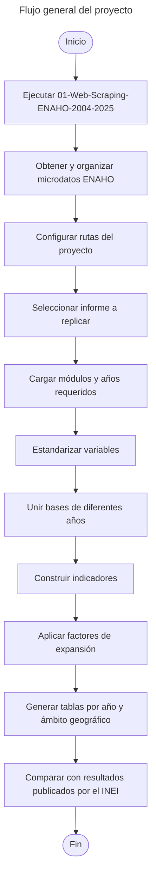

Repositorio en Stata para la construcción de indicadores socioeconómicos a partir de la Encuesta Nacional de Hogares (ENAHO). Incluye procesos automatizados de limpieza, transformación y análisis de datos para generar indicadores reproducibles.

<!--more-->

# Construcción de indicadores a partir de la ENAHO <a id='a'></a>

Este proyecto en **Stata** contiene un conjunto de scripts para el procesamiento y análisis de los microdatos de la **Encuesta Nacional de Hogares (ENAHO)** del Perú, elaborada por el **Instituto Nacional de Estadística e Informática (INEI)**. Su objetivo principal es construir indicadores socioeconómicos a partir de los microdatos de la encuesta y replicar resultados publicados en informes oficiales del INEI.

Actualmente, el proyecto contiene dos scripts principales, orientados a reproducir indicadores correspondientes a los siguientes informes:

1. **Evolución de la Pobreza Monetaria, 2008-2019**
2. **Evolución de los Indicadores de Empleo e Ingresos por Departamento, 2007-2019**

El primer script utiliza principalmente la información del módulo **Sumaria** de la ENAHO para construir indicadores relacionados con las condiciones de vida y la pobreza monetaria, entre ellos el gasto e ingreso real per cápita, la incidencia de la pobreza, la brecha de pobreza y la severidad de la pobreza.

El segundo script está orientado a la construcción de indicadores del **mercado laboral e ingresos**, permitiendo reproducir resultados a nivel nacional y departamental relacionados con participación laboral, empleo, desempleo, características de la población ocupada e ingresos provenientes del trabajo.

Los scripts procesan información de múltiples años de la ENAHO, estandarizan las variables necesarias para construir series de tiempo comparables y generan resultados considerando los factores de expansión y las desagregaciones geográficas utilizadas por el INEI.

> **Importante:** este proyecto **no descarga directamente los microdatos de la ENAHO**. Antes de ejecutar los scripts de construcción de indicadores se debe ejecutar previamente el proyecto [**01-Web-Scraping-ENAHO-2004-2025**](https://github.com/CarloEduardo/01-Web-Scraping-ENAHO-2004-2025), ya que de ese repositorio se obtiene la estructura de carpetas y las bases de datos utilizadas como insumo en este proyecto.

Con el propósito de garantizar la **reproducibilidad, trazabilidad y mantenimiento** del proyecto, el código se gestiona mediante **Git** y se encuentra alojado en **GitHub**, facilitando el control de versiones, la documentación de los cambios y la incorporación progresiva de nuevos indicadores e informes.

## Contenido

1. [Descripción del proyecto](#1)<br>
2. [Requisito previo: descarga de la ENAHO](#2)<br>
3. [Requisitos](#3)<br>
4. [Instalación y configuración](#4)<br>
5. [Estructura del proyecto](#5)<br>
6. [Informes replicados](#6)<br>
   6.1. [Evolución de la Pobreza Monetaria, 2008-2019](#6_1)<br>
   6.2. [Evolución de los Indicadores de Empleo e Ingresos por Departamento, 2007-2019](#6_2)<br>
7. [Metodología general](#7)<br>
8. [Ejecución](#8)<br>
9. [Resultados](#9)<br>
10. [Observaciones](#10)<br>

___

## 1. Descripción del proyecto <a id='1'></a>

El proyecto busca reproducir indicadores oficiales del INEI a partir de los microdatos de la ENAHO mediante scripts desarrollados en **Stata**.

El flujo de trabajo se divide en dos etapas:

1. **Descarga y organización de los microdatos de la ENAHO.** Esta etapa se realiza mediante un proyecto independiente.
2. **Procesamiento de las bases y construcción de indicadores.** Esta etapa corresponde al presente repositorio.

La separación entre ambas etapas permite mantener un flujo de trabajo modular y reproducible: los microdatos se descargan una sola vez y posteriormente pueden reutilizarse para diferentes ejercicios de análisis y replicación.

## 2. Requisito previo: descarga de la ENAHO 📥 <a id='2'></a>

Antes de ejecutar este proyecto es necesario descargar y organizar los microdatos de la ENAHO utilizando el siguiente repositorio:

[**01-Web-Scraping-ENAHO-2004-2025**](https://github.com/CarloEduardo/01-Web-Scraping-ENAHO-2004-2025)

Clonar el repositorio:

```bash
git clone https://github.com/CarloEduardo/01-Web-Scraping-ENAHO-2004-2025.git
```

Luego, ejecutar el script de descarga siguiendo las instrucciones de su `README.md`.

Este proyecto previo descarga los módulos de la ENAHO desde los servidores oficiales del INEI y los organiza por año y módulo. La estructura generada constituye la **fuente de datos de entrada** para los scripts de este repositorio.

Por ejemplo, la estructura esperada es similar a:

```text
01-Web-Scraping-ENAHO-2004-2025/
│
└── Dataset/
    │
    ├── 2007/
    │   └── ...
    ├── 2008/
    │   └── ...
    ├── 2009/
    │   └── ...
    ├── ...
    └── 2019/
        └── ...
```

Por lo tanto, **no es necesario volver a descargar las bases desde este proyecto**. Los scripts leen directamente los archivos `.dta` generados y organizados por `01-Web-Scraping-ENAHO-2004-2025`.

## 3. Requisitos ⚙️ <a id='3'></a>

Para ejecutar este proyecto se requiere:

- **Stata 16** o superior.
- Haber ejecutado previamente el proyecto [**01-Web-Scraping-ENAHO-2004-2025**](https://github.com/CarloEduardo/01-Web-Scraping-ENAHO-2004-2025).
- Tener disponibles localmente los microdatos de la ENAHO requeridos por los scripts.
- Permisos de lectura y escritura en los directorios del proyecto.
- **Git** (opcional), para clonar y actualizar los repositorios.

## 4. Instalación y configuración 🚀 <a id='4'></a>

### 4.1. Clonar este repositorio

Abrir una terminal o Git Bash y ejecutar:

```bash
git clone https://github.com/CarloEduardo/03-Construccion-de-indicadores-a-partir-de-la-ENAHO.git
```

Luego ingresar al directorio del proyecto:

```bash
cd "E:\07. GitHub\03-Construccion-de-indicadores-a-partir-de-la-ENAHO"
```

### 4.2. Configurar las rutas

Antes de ejecutar los scripts, modificar la ruta global utilizada para localizar el proyecto de descarga de la ENAHO.

Por ejemplo:

```stata
global Path "E:\07. GitHub\01-Web-Scraping-ENAHO-2004-2025"
```

A partir de esta ruta, los scripts acceden a las bases organizadas por año y módulo.

Si la ubicación de los repositorios es diferente en otra computadora, únicamente se debe actualizar esta ruta antes de ejecutar el código.

## 5. Estructura del proyecto 📂 <a id='5'></a>

La estructura general del proyecto es la siguiente:

```text
03-Construccion-de-indicadores-a-partir-de-la-ENAHO/
│
├── scripts/
│   ├── 01_Evolucion_Pobreza_Monetaria_2008_2019.do
│   └── 02_Indicadores_Empleo_Ingresos_2007_2019.do
│
├── outputs/
│   └── ...
│
├── README.md
└── LICENSE
```

> Los nombres exactos de las carpetas y archivos pueden variar según la versión del repositorio. Los scripts deben conservar una referencia válida hacia el directorio donde se encuentran los microdatos descargados mediante el proyecto `01-Web-Scraping-ENAHO-2004-2025`.

## 6. Informes replicados 📊 <a id='6'></a>

### 6.1. Evolución de la Pobreza Monetaria, 2008-2019 <a id='6_1'></a>

El primer script replica indicadores publicados en el informe **Evolución de la Pobreza Monetaria, 2008-2019** del INEI.

Para ello se utiliza principalmente el módulo **Sumaria** de la ENAHO y se construyen indicadores como:

- Gasto real per cápita.
- Ingreso real per cápita.
- Incidencia de la pobreza monetaria.
- Brecha de pobreza — FGT(1).
- Severidad de la pobreza — FGT(2).
- Indicadores por ámbito y dominio geográfico.

Los resultados se obtienen utilizando los factores de expansión correspondientes y procurando reproducir las definiciones y desagregaciones utilizadas en los cuadros oficiales del INEI.

### 6.2. Evolución de los Indicadores de Empleo e Ingresos por Departamento, 2007-2019 <a id='6_2'></a>

El segundo script replica indicadores publicados en el informe **Evolución de los Indicadores de Empleo e Ingresos por Departamento, 2007-2019** del INEI.

El procesamiento se orienta a la construcción de indicadores relacionados con:

- Población en edad de trabajar.
- Población económicamente activa.
- Población ocupada.
- Desempleo.
- Características de la población ocupada.
- Ingresos provenientes del trabajo.
- Resultados a nivel nacional y departamental.

## 7. Metodología general <a id='7'></a>

Cada script sigue, de manera general, las siguientes etapas:

1. Define las rutas del proyecto y de los microdatos.
2. Identifica los años requeridos para cada informe.
3. Carga las bases correspondientes desde el repositorio de descarga de la ENAHO.
4. Estandariza nombres y formatos de variables cuando existen diferencias entre años.
5. Une las bases de diferentes años mediante `append` cuando corresponde.
6. Construye las variables e indicadores necesarios.
7. Aplica los factores de expansión de la encuesta.
8. Calcula los indicadores por año y nivel de desagregación geográfica.
9. Genera tablas que permiten comparar los resultados obtenidos con los cuadros publicados por el INEI.

El flujo general puede resumirse de la siguiente manera:



*Elaboración propia.*

## 8. Ejecución ▶️ <a id='8'></a>

El orden recomendado de ejecución es:

### Paso 1. Descargar y organizar la ENAHO

Ejecutar primero el proyecto:

```text
01-Web-Scraping-ENAHO-2004-2025
```

Repositorio:

```text
https://github.com/CarloEduardo/01-Web-Scraping-ENAHO-2004-2025.git
```

### Paso 2. Configurar la ruta de los microdatos

En los scripts de este proyecto, actualizar la ruta correspondiente:

```stata
global Path "E:\07. GitHub\01-Web-Scraping-ENAHO-2004-2025"
```

### Paso 3. Ejecutar el script del informe que se desea replicar

Para pobreza monetaria:

```text
01-Evolución-de-la-pobreza-monetaria-2008-2019.do
```

Para empleo e ingresos:

```text
02-Evolución-de-los-Indicadores-de-Empleo-e-Ingresos-por-Departamento,-2007-2019.do
```

### Paso 4. Revisar los resultados

Comparar las tablas generadas por Stata con los cuadros correspondientes de los informes oficiales del INEI.

## 9. Resultados 📈 <a id='9'></a>

La ejecución de los scripts genera series de indicadores socioeconómicos comparables en el tiempo y organizadas según las desagregaciones utilizadas en los informes oficiales.

El objetivo del proyecto no es reemplazar las estadísticas publicadas por el INEI, sino mostrar de manera reproducible cómo pueden construirse determinados indicadores a partir de los microdatos de la ENAHO.

Las pequeñas diferencias que eventualmente puedan aparecer respecto de los cuadros oficiales deben evaluarse considerando aspectos como las definiciones metodológicas, factores de expansión, filtros, tratamiento de valores perdidos, deflactores y revisiones realizadas por el INEI.

## 10. Observaciones ⚠️ <a id='10'></a>

- La estructura y los nombres de algunas variables de la ENAHO pueden cambiar entre años.
- Los scripts incluyen procesos de estandarización para facilitar el análisis longitudinal.
- La replicación depende de que las bases hayan sido previamente descargadas y organizadas correctamente.
- No se recomienda modificar manualmente la estructura de carpetas generada por `01-Web-Scraping-ENAHO-2004-2025`, salvo que también se actualicen las rutas utilizadas en los scripts.
- Los resultados deben interpretarse considerando las definiciones metodológicas utilizadas por el INEI en cada publicación.

## Licencia 📜

Este proyecto está licenciado bajo la Licencia MIT. Consulta el archivo [LICENSE](/LICENSE) para más detalles.

## Autor 👨‍💻

**Carlos Eduardo Torres García**

[](https://www.linkedin.com/in/carlo4-eduardo-torres-garcia/)
[](https://x.com/Carlo4_Eduardo)

[**⬆ Volver al inicio**](#a)
