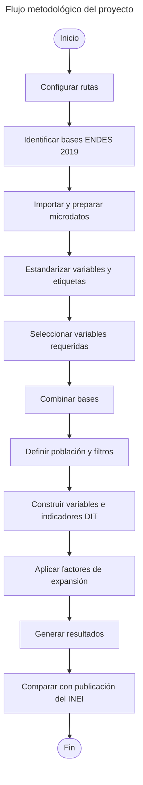

Repositorio en Stata para la construcción de indicadores demográficos y de salud a partir de la Encuesta Demográfica y de Salud Familiar (ENDES). Incluye procesos automatizados de procesamiento, análisis y generación de indicadores.

<!--more-->

# Construcción de indicadores de Desarrollo Infantil Temprano a partir de la ENDES <a id='a'></a>

Este proyecto en **Stata** contiene scripts para el procesamiento y análisis de los microdatos de la **Encuesta Demográfica y de Salud Familiar (ENDES)**, elaborada por el **Instituto Nacional de Estadística e Informática (INEI)**.

El objetivo del proyecto es reproducir, a partir de los microdatos de la **ENDES 2019**, indicadores publicados en el documento **“DESARROLLO INFANTIL TEMPRANO en niñas y niños menores de 6 años de edad - ENDES, 2019”**.

La replicación utiliza las bases correspondientes a los distintos cuestionarios y módulos de la ENDES requeridos para construir los indicadores de Desarrollo Infantil Temprano (DIT). Los scripts organizan, procesan y combinan estas fuentes de información, generan las variables necesarias y permiten contrastar los resultados obtenidos con los publicados por el INEI.

Con el propósito de garantizar la **reproducibilidad, trazabilidad y mantenimiento** del proyecto, el código se gestiona mediante **Git** y se encuentra alojado en **GitHub**, facilitando el control de versiones, la documentación de los cambios y la incorporación progresiva de nuevos indicadores.

## Contenido

1. [Descripción del proyecto](#1)<br>
2. [Fuente de información](#2)<br>
3. [Requisitos](#3)<br>
4. [Instalación y configuración](#4)<br>
5. [Estructura del proyecto](#5)<br>
6. [Documento replicado](#6)<br>
7. [Bases y cuestionarios utilizados](#7)<br>
8. [Metodología general](#8)<br>
9. [Ejecución](#9)<br>
10. [Resultados](#10)<br>
11. [Observaciones](#11)<br>

___

## 1. Descripción del proyecto <a id='1'></a>

El proyecto busca reproducir indicadores oficiales de **Desarrollo Infantil Temprano (DIT)** publicados por el INEI utilizando los microdatos de la **ENDES 2019** y scripts desarrollados en **Stata**.

El flujo de trabajo comprende la organización de las bases de datos de la ENDES, la selección de las variables requeridas, el procesamiento y combinación de los diferentes módulos, la construcción de los indicadores y la comparación de los resultados con los valores publicados en el documento oficial.

La organización modular del proyecto permite conservar separadas las bases de datos, los scripts de procesamiento y los resultados generados, facilitando la revisión y reproducción del análisis.

## 2. Fuente de información 📥 <a id='2'></a>

La principal fuente de información es la **Encuesta Demográfica y de Salud Familiar (ENDES) 2019** del Instituto Nacional de Estadística e Informática (INEI).

Para ejecutar los scripts es necesario disponer localmente de los archivos de microdatos de la ENDES 2019 utilizados en la construcción de los indicadores.

Las bases originales pueden encontrarse en formato SPSS (`.sav`) y son procesadas mediante Stata para generar archivos (`.dta`) utilizados en las etapas posteriores del proyecto.

El proyecto trabaja con información proveniente de diferentes cuestionarios de la ENDES debido a que la construcción de los indicadores de Desarrollo Infantil Temprano requiere variables correspondientes al hogar, la vivienda, las mujeres, niñas y niños y otros componentes de la encuesta.

## 3. Requisitos ⚙️ <a id='3'></a>

Para ejecutar este proyecto se requiere:

- **Stata 16** o superior.
- Tener disponibles localmente los microdatos requeridos de la **ENDES 2019**.
- Permisos de lectura y escritura en los directorios utilizados por el proyecto.
- **Git** (opcional), para clonar, versionar y actualizar el repositorio.

## 4. Instalación y configuración 🚀 <a id='4'></a>

### 4.1. Clonar el repositorio

Abrir una terminal o Git Bash y ejecutar:

```bash
git clone https://github.com/CarloEduardo/03-Construccion-de-indicadores-a-partir-de-la-ENAHO.git
```

Luego ingresar al directorio del proyecto:

```bash
cd "E:\07. GitHub\03-Construccion-de-indicadores-a-partir-de-la-ENAHO"
```

### 4.2. Configurar las rutas

Antes de ejecutar los scripts, se deben modificar las rutas globales para que correspondan a la ubicación de los microdatos y del proyecto en la computadora del usuario.

Por ejemplo:

```stata
global Path    "E:\01. DataBase\01. INEI\02. ENDES"
global Dataset "E:\07. GitHub\03-Construccion-de-indicadores-a-partir-de-la-ENAHO\01. DESARROLLO INFANTIL TEMPRANO en niñas y niños menores de 6 años de edad - ENDES, 2019"
```

Si las carpetas se encuentran en otra ubicación, únicamente deben actualizarse estas rutas antes de ejecutar los scripts.

## 5. Estructura del proyecto 📂 <a id='5'></a>

Para la replicación del documento de Desarrollo Infantil Temprano, la información se organiza de acuerdo con los diferentes componentes de la ENDES utilizados durante el procesamiento.

Una estructura de referencia es:

```text
01. DESARROLLO INFANTIL TEMPRANO en niñas y niños menores de 6 años de edad - ENDES, 2019/
│
├── 01. Caracteristicas del Hogar/
├── 02. Caracteristicas de la Vivienda/
├── 03. Programas Sociales/
├── 04. Datos Basicos de MEF/
├── 05. Historia de Nacimiento - Tabla de Conocimiento de Metodo/
├── 06. Embarazo, Parto, Puerperio y Lactancia/
├── 07. Inmunizacion y Salud/
├── 08. Nupcialidad - Fecundidad - Conyugue y Mujer/
├── 09. Conocimiento de Sida y uso del condon/
├── 10. Mortalidad Materna - Violencia Familiar/
├── 11. Peso y talla - Anemia/
├── 12. Disciplina Infantil/
├── 13. Encuesta de salud/
│
├── README.md
└── LICENSE
```

Las carpetas permiten organizar las bases y los procesos asociados con los diferentes cuestionarios y módulos utilizados en la replicación.

## 6. Documento replicado 📊 <a id='6'></a>

El proyecto está orientado específicamente a reproducir resultados publicados en:

**DESARROLLO INFANTIL TEMPRANO en niñas y niños menores de 6 años de edad - ENDES, 2019**

La finalidad es reconstruir, utilizando los microdatos de la encuesta, los indicadores incluidos en el documento y disponer de un procedimiento reproducible que permita identificar las variables, filtros, transformaciones y factores de expansión empleados durante su cálculo.

## 7. Bases y cuestionarios utilizados 🗂️ <a id='7'></a>

El procesamiento considera información organizada en los siguientes componentes:

### Cuestionario del hogar

1. **Características del Hogar**
2. **Características de la Vivienda**
3. **Programas Sociales**

### Cuestionario individual - Mujeres de 12 a 49 años

4. **Datos Básicos de MEF**
5. **Historia de Nacimiento - Tabla de Conocimiento de Método**
6. **Embarazo, Parto, Puerperio y Lactancia**
7. **Inmunización y Salud**
8. **Nupcialidad - Fecundidad - Cónyuge y Mujer**
9. **Conocimiento de Sida y uso del condón**
10. **Mortalidad Materna - Violencia Familiar**
11. **Peso y talla - Anemia**
12. **Disciplina Infantil**

### Cuestionario de salud

13. **Encuesta de salud**

Los archivos correspondientes son preparados y transformados a formatos compatibles con Stata para su posterior procesamiento.

## 8. Metodología general <a id='8'></a>

De manera general, los scripts siguen las siguientes etapas:

1. Definición de las rutas de trabajo.
2. Identificación de los archivos y módulos requeridos de la ENDES 2019.
3. Importación de las bases originales.
4. Conversión y almacenamiento de las bases en formato Stata (`.dta`) cuando corresponde.
5. Revisión y estandarización de variables y etiquetas.
6. Selección de las variables necesarias para cada indicador.
7. Combinación de bases mediante identificadores comunes cuando corresponde.
8. Aplicación de filtros y criterios de población definidos para cada indicador.
9. Construcción de las variables requeridas.
10. Aplicación de los factores de expansión correspondientes.
11. Cálculo de los indicadores de Desarrollo Infantil Temprano.
12. Comparación de los resultados obtenidos con los valores publicados por el INEI.

El flujo general puede resumirse de la siguiente manera:



*Elaboración propia.*

## 9. Ejecución ▶️ <a id='9'></a>

El orden recomendado de ejecución es:

### Paso 1. Obtener los microdatos de la ENDES 2019

Descargar y organizar las bases requeridas de la **Encuesta Demográfica y de Salud Familiar (ENDES) 2019**.

### Paso 2. Configurar las rutas

Actualizar en los scripts las rutas correspondientes a la ubicación local de las bases y del proyecto.

Por ejemplo:

```stata
global Path "E:\01. DataBase\01. INEI\02. ENDES"
```

### Paso 3. Preparar las bases

Ejecutar los bloques encargados de importar los archivos originales (`.sav`), revisar sus etiquetas y generar las bases de trabajo en formato Stata (`.dta`).

### Paso 4. Ejecutar los scripts de construcción de indicadores

Ejecutar los scripts correspondientes a los indicadores del documento:

```text
01-DESARROLLO-INFANTIL-TEMPRANO-en-niñas-y-niños-menores-de-6-años-de-edad-ENDES,-2019
```

### Paso 5. Revisar los resultados

Comparar los indicadores obtenidos mediante Stata con los resultados correspondientes publicados por el INEI.

## 10. Resultados 📈 <a id='10'></a>

La ejecución de los scripts permite reconstruir indicadores de **Desarrollo Infantil Temprano** utilizando directamente los microdatos de la ENDES 2019.

El objetivo del proyecto no es reemplazar las estadísticas oficiales publicadas por el INEI, sino documentar de manera reproducible el procedimiento necesario para obtener determinados resultados a partir de los microdatos.

La comparación entre los resultados reproducidos y los publicados permite evaluar la correcta selección de la población de análisis, las variables utilizadas, los filtros aplicados y los factores de expansión.

## 11. Observaciones ⚠️ <a id='11'></a>

- La construcción de los indicadores depende de la correcta identificación de las bases y variables de la **ENDES 2019**.
- Un mismo indicador puede requerir información proveniente de diferentes cuestionarios o módulos.
- Los archivos originales pueden requerir procesos previos de importación, conversión y estandarización antes de ser utilizados.
- Las bases generadas durante el procesamiento pueden excluirse del repositorio mediante `.gitignore`, manteniendo versionados los scripts y demás archivos necesarios para la reproducción del análisis.
- Los resultados deben interpretarse considerando las definiciones, filtros, universos de estudio y factores de expansión utilizados en la publicación oficial del INEI.
- Las diferencias respecto de los resultados publicados deben revisarse considerando la selección de variables, tratamiento de valores perdidos, criterios de inclusión y ponderadores utilizados.

## Licencia 📜

Este proyecto está licenciado bajo la Licencia MIT. Consulta el archivo [LICENSE](/LICENSE) para más detalles.

## Autor 👨‍💻

**Carlos Eduardo Torres García**

[](https://www.linkedin.com/in/carlo4-eduardo-torres-garcia/)

[](https://x.com/Carlo4_Eduardo)

[**⬆ Volver al inicio**](#a)