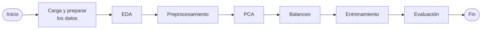

Modelo de aprendizaje automático desarrollado en Python para predecir el abandono de clientes (churn). El proyecto abarca limpieza y transformación de datos, análisis exploratorio, selección de variables, tratamiento del desbalance de clases, entrenamiento y comparación de modelos de clasificación, validación cruzada y visualización de resultados mediante un dashboard en Power BI.

<!--more-->

# Predicción del abandono de clientes 🤖


Una empresa de telecomunicaciones (Vodafone) desea estimar la probabilidad de que un cliente abandone la compañía. Este proyecto tiene como objetivo desarrollar un modelo de clasificación capaz de predecir si un cliente abandonará el servicio (**churn**) o permanecerá en la empresa.

## Descripción General del Proyecto

En este proyecto se emplean técnicas de **Machine Learning Supervisado (Clasificación)** para analizar la importancia de la analítica de abandono de clientes (*churn analytics*) como una herramienta estratégica para las empresas de telecomunicaciones. El propósito es identificar de manera proactiva los principales factores de riesgo asociados al abandono de clientes, optimizar las estrategias de retención y fortalecer las relaciones a largo plazo con los usuarios.

El proyecto sigue la metodología **CRISP-DM (Cross-Industry Standard Process for Data Mining)**, un marco de trabajo ampliamente utilizado en proyectos de minería de datos y ciencia de datos, para explorar, procesar y analizar el fenómeno del abandono de clientes dentro de la red de servicios de Vodafone.

El modelo predictivo de abandono de clientes constituye una solución basada en datos diseñada para abordar el desafío constante de la pérdida de clientes en industrias basadas en suscripciones. Su objetivo es identificar a los clientes con mayor riesgo de abandonar el servicio, permitiendo a la empresa implementar acciones preventivas y desarrollar estrategias de retención personalizadas que contribuyan a mejorar la fidelización de los clientes.

## Contenido 📖
1. [Objetivos](#objetivos)<br>
   1.1 [Objetivo general](#objetivo-general)<br>
   1.2 [Objetivos específicos](#objetivos-especificos)<br>   
2. [Dataset](#dataset)<br>
3. [Variables](#variables)<br>
4. [Requisitos](#requisitos)<br>
   4.1 [Sistema](#sistema)<br>
   4.2 [Herramientas](#herramientas)<br>
   4.3 [Bibliotecas](#bibliotecas)<br>
5. [Instalación y uso](#instalacion-y-uso)<br>
   5.1 [Clonar el repositorio](#clonar-el-repositorio)<br>
   5.2 [Estructura](#estructura)<br>
   5.3 [Cómo ejecutar el proyecto](#como-ejecutar-el-proyecto)<br>
6. [Metodología](#metodologia)<br>
   6.1 [Carga y preparar los datos](#carga-y-preparar-los-datos)<br>
   6.2 [Análisis exploratorio (EDA)](#eda)<br>
   6.3 [Preprocesamiento](#preprocesamiento)<br>
   6.4 [Tratamiento del desbalance](#tratamiento-del-desbalance)<br>
   6.5 [Entrenamiento](#entrenamiento)<br>
   6.6 [Validación](#validacion)<br>
7. [Modelos de Machine Learning](#modelos-de-machine-learning)<br>
   7.1 [Logistic Regression](#logistic-regression)<br>
   7.2 [K-Nearest Neighbors](#k-nearest-neighbors)<br>
   7.3 [Decision Trees](decision-trees)<br>
   7.4 [Random Forest](#random-forest)<br>
   7.5 [Support Vector Machine (SVM)](#support-vector-machine)<br>
   7.6 [Gradient Boosting](#gradient-boosting)<br>
   7.7 [XGBoost](#xgboost)<br>
8. [Resultados](#resultados)<br>
   8.1 [Métricas de evaluación](#metricas-de-evaluacion)<br>
   8.2 [Comparación de modelos](#comparacion-de-modelos)<br>
   8.3 [Mejor modelo](#mejor-modelo)<br>
9. [Conclusiones](#conclusiones)<br>


## 1. Objetivos 🎯 <a id="objetivos"></a>

### 1.1. Objetivo general <a id="objetivo-general"></a>
Desarrollar un modelo de aprendizaje supervisado capaz de predecir si un cliente abandonará el servicio (**churn**) o permanecerá en la empresa.

### 1.2. Objetivos específicos <a id="objetivos-especificos"></a>
- Analizar el comportamiento de los clientes.
- Identificar las variables más relevantes.
- Comparar diferentes algoritmos.
- Evaluar técnicas de balanceo de clases.
- Seleccionar el modelo con mejor desempeño.

## 2. Dataset 📂 <a id="dataset"></a>
- **Observaciones**: 7,043
- **Variables predictoras**: 20
- **Variable objetivo**: Churn

## 3. Variables 💾 <a id="variables"></a>

El conjunto de datos contiene 20 variables predictoras agrupadas en cuatro categorías: información personal del cliente, historial de pagos, estado de cuenta mensual y pagos realizados.

| **Nombre de la Variable** | **Descripción** | **Tipo de Dato** |
|---------------------------|-----------------|------------------|
| `customerID` | Contiene el identificador único del cliente. | Categórico |
| `gender` | Indica si el cliente es mujer o hombre. | Categórico |
| `SeniorCitizen` | Indica si el cliente es un adulto mayor o no (1 = Sí, 0 = No). | Numérico (entero) |
| `Partner` | Indica si el cliente tiene pareja (Sí, No). | Categórico |
| `Dependents` | Indica si el cliente tiene dependientes (Sí, No). | Categórico |
| `tenure` | Número de meses que el cliente ha permanecido en la empresa. | Numérico (entero) |
| `PhoneService` | Indica si el cliente cuenta con servicio telefónico (Sí, No). | Categórico |
| `MultipleLines` | Indica si el cliente tiene múltiples líneas telefónicas (Sí, No, Sin servicio telefónico). | Categórico |
| `InternetService` | Tipo de servicio de Internet del cliente (DSL, Fibra óptica, Sin servicio). | Categórico |
| `OnlineSecurity` | Indica si el cliente cuenta con servicio de seguridad en línea (Sí, No, Sin servicio de Internet). | Categórico |
| `OnlineBackup` | Indica si el cliente cuenta con servicio de respaldo en línea (Sí, No, Sin servicio de Internet). | Categórico |
| `DeviceProtection` | Indica si el cliente cuenta con servicio de protección de dispositivos (Sí, No, Sin servicio de Internet). | Categórico |
| `TechSupport` | Indica si el cliente cuenta con soporte técnico (Sí, No, Sin servicio de Internet). | Categórico |
| `StreamingTV` | Indica si el cliente cuenta con servicio de televisión por streaming (Sí, No, Sin servicio de Internet). | Categórico |
| `StreamingMovies` | Indica si el cliente cuenta con servicio de películas por streaming (Sí, No, Sin servicio de Internet). | Categórico |
| `Contract` | Tipo de contrato del cliente (Mensual, Un año, Dos años). | Categórico |
| `PaperlessBilling` | Indica si el cliente utiliza facturación electrónica (Sí, No). | Categórico |
| `PaymentMethod` | Método de pago del cliente (Cheque electrónico, Cheque enviado por correo, Transferencia bancaria, Tarjeta de crédito). | Categórico |
| `MonthlyCharges` | Monto cobrado mensualmente al cliente. | Numérico (decimal) |
| `TotalCharges` | Monto total cobrado al cliente. | Objeto (object) |
| `Churn` | Indica si el cliente abandonó el servicio o no (Sí, No). | Categórico |

## 4. Requisitos 🛠️ <a id='requisitos'></a>

### 4.1. Sistema 💻 <a id='sistema'></a>
<p align="left">

</p>

- Python **3.10** o superior.
- Sistema operativo: Windows, Linux o macOS.
- Memoria RAM recomendada: **4 GB** o superior.

### 4.2. Herramientas 🔧 <a id='herramientas'></a>
<p align="left">


</p>

- Git
- GitHub
- Visual Studio Code
- Jupyter Notebook

### 4.3. Bibliotecas 📦 <a id='bibliotecas'></a>
<p align="left">


</p>

- pandas
- NumPy
- SciPy
- scikit-learn
- imbalanced-learn
- Matplotlib
- Seaborn
- XGBoost

> Instale Las bibliotecas o paquetes requeridos especificados en el archivo `requirements.txt`. para que puedan importarse correctamente en el script y el cuaderno de Python (.ipynb) sin inconvenientes.

## 5. Instalación y uso 🚀 <a id='instalacion-y-uso'></a>

### 5.1. Clonar el repositorio 📥 <a id='clonar-el-repositorio'></a>

1. Abrir una terminal o línea de comandos Git Bash.

2. Ejecutar el siguiente comando para clonar el repositorio en tu máquina local:
```bash
git clone https://github.com/CarloEduardo/05-Prediccion-de-Abandono-de-Clientes.git
```

3. Establecer como directorio de trabajo la carpeta clonada.
```
cd \E:\07. GitHub\05-Prediccion-de-Abandono-de-Clientes\
```

### 5.2. Estructura 📁 <a id='estructura'></a>
```text
├── data/
│   ├── raw/
│   └── processed/
├── images/
│   ├── raw/
│   └── processed/
├── Prediccion-de-Abandono-de-Clientes.ipynb
├── requirements.txt
└── README.md
```

### 5.3. Cómo ejecutar el proyecto ▶️ <a id='como-ejecutar-el-proyecto'></a>

1. Abrir el archivo 
```bash
Prediccion-de-Abandono-de-Clientes.ipynb
```

2. Instalar las dependencias requeridas especificadas en el archivo `requirements.txt`.

Desde una terminal:
```bash
pip install -r requirements.txt
```

Desde una celda de Jupyter Notebook:
```python
import sys
!"{sys.executable}" -m pip install -r requirements.txt
```

## 6. Metodología 🔄 <a id="metodologia"></a>

### Flujo metodológico del proyecto



### 6.1. Carga y preparar los datos 📄 <a id="carga-y-preparar-los-datos"></a>
- Carga y revisión de la estructura del conjunto de datos.
- Renombrado de variables y verificación de valores faltantes.
- Eliminación de categorías no válidas o no documentadas en `TotalCharges` y `tenure`.
- Obtención de un conjunto final de 7 031 observaciones.

### 6.2. Análisis exploratorio (EDA) 🔍 <a id="eda"></a>
- Análisis univariado, bivariado y multivariado de las variables.
- Evaluación de la distribución de la variable objetivo `Churn`.
- Identificación de valores atípicos y análisis de distribuciones.
- Evaluación de correlaciones mediante el coeficiente de Pearson.
- Evaluación de normalidad mediante QQ-plots y la prueba K² de D'Agostino.
- Análisis de dependencia mediante Información Mutua (Mutual Information).

### 6.3. Preprocesamiento 🧹 <a id="preprocesamiento"></a>
- Transformación de variables categóricas para su uso en los modelos.
- Normalización mediante `MinMaxScaler`.
- Estandarización mediante `StandardScaler`.
- Preparación y partición de los datos en conjuntos de entrenamiento y prueba.

### 6.4. Tratamiento del desbalance ⚖ <a id="tratamiento-del-desbalance"></a>
- Evaluación del desbalance de clases de la variable objetivo `Churn`.
- Aplicación de técnicas de sobremuestreo: `SMOTE`

### 6.5. Entrenamiento 🏋️ <a id="entrenamiento"></a>
- Entrenamiento y comparación de diferentes algoritmos de clasificación.
- Optimización de hiperparámetros mediante `GridSearchCV`.
- Entrenamiento bajo diferentes escenarios de preprocesamiento y balanceo.

### 6.6. Validación ✅ <a id="validacion"></a>
- Validación cruzada mediante K-Fold.
- Selección de la mejor configuración utilizando el `F1-score`.
- Evaluación sobre el conjunto de prueba mediante Accuracy, Recall, Precision, F1-score y AUC.
- Comparación del desempeño de los modelos para seleccionar la mejor alternativa.

## 7. Modelos de Machine Learning 🤖 <a id="modelos-de-machine-learning"></a>

| Modelo | Descripción |
|--------|-------------|
| Logistic Regression | Modelo lineal de clasificación probabilística |
| K-Nearest Neighbors | Clasificador basado en los vecinos más cercanos |
| Decision Tree | Clasificador basado en reglas y particiones jerárquicas |
| Random Forest | Ensamble de múltiples árboles de decisión |
| Support Vector Machine | Clasificador basado en la construcción de un hiperplano óptimo |
| Gradient Boosting | Ensamble secuencial de árboles que corrige los errores de modelos anteriores |
| XGBoost | Implementación optimizada de Gradient Boosting |

### 7.1. Logistic Regression 📈 <a id="logistic-regression"></a>

### 7.2. K-Nearest Neighbors 👥 <a id="k-nearest-neighbors"></a>

### 7.3. Decision Trees 🌳 <a id="decision-trees"></a>

### 7.4. Random Forest 🌳🌳🌳 <a id="random-forest"></a>

### 7.5. Support Vector Machine (SVM) 📐 <a id="support-vector-machine"></a>

### 7.6. Gradient Boosting 🌱 <a id="gradient-boosting"></a>

### 7.7. XGBoost ⚡ <a id="xgboost"></a>

## 8. Resultados 📊 <a id="resultados"></a>

<table>
    <tr>
        <th> Precisión de los Modelos Entrenados </th>
    </tr>
    <tr>
        <td></td>
    </tr>
</table>

## 9. Conclusiones 💡 <a id="conclusiones"></a>

- El número de meses que el cliente ha permanecido en la empresa (**tenure**) y el tipo de contrato del cliente (**Contract**) son las variables más importantes y presentan la mayor relación con el abandono de clientes (**Churn**).

- Vodafone debería fortalecer la experiencia del cliente durante los primeros meses de permanencia. El análisis muestra que entre los **5 y 10 primeros meses** los clientes presentan una mayor probabilidad de abandonar el servicio, lo que indica que la experiencia inicial es determinante. Mejorar el proceso de incorporación (*onboarding*), la calidad del servicio y brindar un soporte técnico oportuno durante este periodo puede incrementar la satisfacción y la fidelización de los clientes.

- Vodafone debería promover contratos de mayor duración. Los resultados muestran que los clientes con contratos **mensuales (Month-to-Month)** presentan una tasa de abandono significativamente mayor que aquellos con contratos de **uno o dos años**. Incentivar la contratación de planes de mayor duración mediante beneficios, promociones y un mejor soporte técnico podría reducir la tasa de abandono y fortalecer el compromiso de los clientes con la empresa.

- El ajuste de hiperparámetros (*Hyperparameter Tuning*) no siempre produce mejoras significativas en el rendimiento de los modelos.

- Utilizando una partición de **80% para entrenamiento y 20% para evaluación**, el modelo **Random Forest** alcanzó una precisión aproximada del **86%** después del ajuste de hiperparámetros.

- Los métodos de **ensamble (Ensemble Methods)** presentan un mejor desempeño en tareas de clasificación en comparación con los modelos basados en un único clasificador.

## Referencias 📚
- Scikit-learn
- SMOTE paper
- PCA paper

## Licencia 📜
Este proyecto está licenciado bajo la Licencia MIT. Consulta el archivo [LICENSE](/LICENSE) para más detalles.

## Autor 👨‍💻
**Carlos Eduardo Torres García**

[](https://www.linkedin.com/in/carlo4-eduardo-torres-garcia/)
[](https://x.com/Carlo4_Eduardo)

[**⬆ Volver al inicio**](#a)