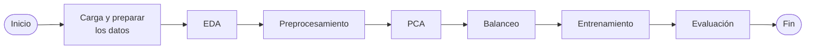

Modelo de aprendizaje automático desarrollado en Python para predecir el incumplimiento de crédito de clientes. El proyecto incluye preprocesamiento de datos, análisis exploratorio, ingeniería de características, entrenamiento y evaluación de modelos de clasificación, optimización de hiperparámetros e interpretación de resultados mediante métricas de desempeño.

<!--more-->

# Predicción del Incumplimiento de Pago de Tarjetas de Crédito 💳


## Descripción del Proyecto 📌

Este proyecto tiene como objetivo identificar los principales factores que influyen en el incumplimiento del pago de tarjetas de crédito y desarrollar un modelo predictivo capaz de estimar la probabilidad de que un cliente incurra en morosidad.

Para ello, se emplean algoritmos de Machine Learning supervisado utilizando información demográfica, financiera e histórica de los clientes. Además de construir un modelo de predicción, el proyecto busca analizar la importancia de las variables que explican el riesgo de incumplimiento.

Entre los algoritmos evaluados se encuentran Logistic Regression, Random Forest y Support Vector Machines(SVM), comparando su desempeño para seleccionar el modelo con mejores resultados en la clasificación de clientes morosos y no morosos.

## Contenido 📖
1. [Objetivos](#objetivos)<br>
   1.1 [Objetivo general](#objetivo-general)<br>
   1.2 [Objetivos específicos](#objetivos-especificos)<br>   
2. [Dataset](#dataset)<br>
3. [Variables](#variables)<br>
4. [Requisitos](#requisitos)<br>
   4.1 [Sistema](#sistema)<br>
   4.2 [Herramientas](#herramientas)<br>
   4.3 [Bibliotecas](#bibliotecas)<br>
5. [Instalación y uso](#instalacion-y-uso)<br>
   5.1- [Clonar el repositorio](#clonar-el-repositorio)<br>
   5.2- [Estructura](#estructura)<br>
   5.3- [Cómo ejecutar el proyecto](#como-ejecutar-el-proyecto)<br>
6. [Metodología](#metodologia)<br>
   6.1 [Carga y preparar los datos](#carga-y-preparar-los-datos)<br>
   6.2 [Análisis exploratorio (EDA)](#eda)<br>
   6.3 [Preprocesamiento](#preprocesamiento)<br>
   6.4 [Reducción de la dimensionalidad](#reduccion-de-la-dimensionalidad)<br>
   6.5 [Tratamiento del desbalance](#tratamiento-del-desbalance)<br>
   6.6 [Entrenamiento](#entrenamiento)<br>
   6.7 [Validación](#validacion)<br>
7. [Modelos de Machine Learning](#modelos-de-machine-learning)<br>
   7.1 [Logistic Regression](#logistic-regression)<br>
   7.2 [K-Nearest Neighbors](#k-nearest-neighbors)<br>
   7.3 [Decision Trees](decision-trees)<br>
   7.4 [Random Forest](#random-forest)<br>
   7.5 [Support Vector Machine (SVM)](#support-vector-machine)<br>
   7.6 [Gradient Boosting](#gradient-boosting)<br>
   7.7 [XGBoost](#xgboost)<br>
8. [Resultados](#resultados)<br>
   8.1 [Métricas de evaluación](#metricas-de-evaluacion)<br>
   8.2 [Comparación de modelos](#comparacion-de-modelos)<br>
   8.3 [Mejor modelo](#mejor-modelo)<br>
9. [Conclusiones](#conclusiones)<br>

## 1. Objetivos 🎯 <a id="objetivos"></a>

### 1.1. Objetivo general <a id="objetivo-general"></a>
Desarrollar un modelo de aprendizaje supervisado capaz de predecir el incumplimiento del pago de tarjetas de crédito.

### 1.2. Objetivos específicos <a id="objetivos-especificos"></a>
- Analizar el comportamiento de los clientes.
- Identificar las variables más relevantes.
- Comparar diferentes algoritmos.
- Evaluar técnicas de balanceo de clases.
- Seleccionar el modelo con mejor desempeño.

## 2. Dataset 📂 <a id="dataset"></a>
- **Fuente**: UCI Machine Learning Repository
- **Observaciones**: 30,000
- **Variables predictoras**: 23
- **Variable objetivo**: default.payment.next.month

## 3. Variables 💾 <a id="variables"></a>

El conjunto de datos contiene 23 variables predictoras agrupadas en cuatro categorías: información personal del cliente, historial de pagos, estado de cuenta mensual y pagos realizados.

| **Grupo de Variables** | **Nombre de la Variable** | **Descripción** | **Tipo de Dato** |
|------------------------|---------------------------|-----------------|------------------|
| Información personal del cliente | `LIMIT_BAL` | Monto de la línea de crédito otorgada (en dólares taiwaneses), incluyendo el crédito individual y el crédito suplementario familiar. | Numérico (entero) |
| Información personal del cliente | `SEX` | Sexo del cliente (1 = Hombre, 2 = Mujer). | Categórico |
| Información personal del cliente | `EDUCATION` | Nivel educativo (1 = Posgrado, 2 = Universidad, 3 = Secundaria, 4 = Otros). | Categórico |
| Información personal del cliente | `MARRIAGE` | Estado civil (1 = Casado, 2 = Soltero, 3 = Otros). | Categórico |
| Información personal del cliente | `AGE` | Edad del cliente, expresada en años. | Numérico (entero) |
| Historial de pagos | `PAY_1` | Estado de pago en septiembre de 2005. | Categórico |
| Historial de pagos | `PAY_2` | Estado de pago en agosto de 2005. | Categórico |
| Historial de pagos | `PAY_3` | Estado de pago en julio de 2005. | Categórico |
| Historial de pagos | `PAY_4` | Estado de pago en junio de 2005. | Categórico |
| Historial de pagos | `PAY_5` | Estado de pago en mayo de 2005.  | Categórico |
| Historial de pagos | `PAY_6` | Estado de pago en abril de 2005. | Categórico |
| Estado de cuenta mensual | `BILL_AMT1` | Estado de cuenta de septiembre de 2005. | Numérico (entero) |
| Estado de cuenta mensual | `BILL_AMT2` | Estado de cuenta de agosto de 2005. | Numérico (entero) |
| Estado de cuenta mensual | `BILL_AMT3` | Estado de cuenta de julio de 2005. | Numérico (entero) |
| Estado de cuenta mensual | `BILL_AMT4` | Estado de cuenta de junio de 2005. | Numérico (entero) |
| Estado de cuenta mensual | `BILL_AMT5` | Estado de cuenta de mayo de 2005. | Numérico (entero) |
| Estado de cuenta mensual | `BILL_AMT6` | Estado de cuenta de abril de 2005. | Numérico (entero) |
| Pagos realizados | `PAY_AMT1` | Pago realizado en septiembre de 2005. | Numérico (entero) |
| Pagos realizados | `PAY_AMT2` | Pago realizado en agosto de 2005. | Numérico (entero) |
| Pagos realizados | `PAY_AMT3` | Pago realizado en julio de 2005. | Numérico (entero) |
| Pagos realizados | `PAY_AMT4` | Pago realizado en junio de 2005. | Numérico (entero) |
| Pagos realizados | `PAY_AMT5` | Pago realizado en mayo de 2005. | Numérico (entero) |
| Pagos realizados | `PAY_AMT6` | Pago realizado en abril de 2005. | Numérico (entero) |

La escala utilizada para las variables `Historial de pagos`:
- **-1:** Pago realizado puntualmente.
- **1:** Retraso de un mes.
- **2:** Retraso de dos meses.
- ...
- **8:** Retraso de ocho meses.
- **9:** Retraso de nueve meses o más.

## 4. Requisitos 🛠️ <a id='requisitos'></a>

### 4.1. Sistema 💻 <a id='sistema'></a>
<p align="left">

</p>

- Python **3.10** o superior.
- Sistema operativo: Windows, Linux o macOS.
- Memoria RAM recomendada: **4 GB** o superior.

### 4.2. Herramientas 🔧 <a id='herramientas'></a>
<p align="left">


</p>

- Git
- GitHub
- Visual Studio Code
- Jupyter Notebook

### 4.3. Bibliotecas 📦 <a id='bibliotecas'></a>
<p align="left">


</p>

- pandas
- NumPy
- SciPy
- scikit-learn
- imbalanced-learn
- Matplotlib
- Seaborn
- XGBoost

> Instale Las bibliotecas o paquetes requeridos especificados en el archivo `requirements.txt`. para que puedan importarse correctamente en el script y el cuaderno de Python (.ipynb) sin inconvenientes.

## 5. Instalación y uso 🚀 <a id='instalacion-y-uso'></a>

### 5.1. Clonar el repositorio 📥 <a id='clonar-el-repositorio'></a>

1. Abrir una terminal o línea de comandos Git Bash.

2. Ejecutar el siguiente comando para clonar el repositorio en tu máquina local:
```bash
git clone https://github.com/CarloEduardo/06-Prediccion-de-Incumplimiento-de-Credito.git
```

3. Establecer como directorio de trabajo la carpeta clonada.
```
cd \E:\07. GitHub\06-Prediccion-de-Incumplimiento-de-Credito\
```

### 5.2. Estructura 📁 <a id='estructura'></a>
```text
├── data/
│   ├── raw/
│   └── processed/
├── images/
│   ├── raw/
│   └── processed/
├── Prediccion-de-Incumplimiento-de-Credito.ipynb
├── requirements.txt
└── README.md
```

### 5.3. Cómo ejecutar el proyecto ▶️ <a id='como-ejecutar-el-proyecto'></a>

1. Abrir el archivo 
```bash
Prediccion-de-Incumplimiento-de-Credito.ipynb
```

2. Instalar las dependencias requeridas especificadas en el archivo `requirements.txt`.

Desde una terminal:
```bash
pip install -r requirements.txt
```

Desde una celda de Jupyter Notebook:
```python
import sys
!"{sys.executable}" -m pip install -r requirements.txt
```

## 6. Metodología 🔄 <a id="metodologia"></a>

### Flujo metodológico del proyecto



### 6.1. Carga y preparar los datos 📄 <a id="carga-y-preparar-los-datos"></a>
- Carga y revisión de la estructura del conjunto de datos.
- Renombrado de variables y verificación de valores faltantes.
- Recodificación de los estados de pago (PAY_1–PAY_6).
- Eliminación de categorías no válidas o no documentadas en `EDUCATION` y `MARRIAGE`.
- Obtención de un conjunto final de 29 601 observaciones.

### 6.2. Análisis exploratorio (EDA) 🔍 <a id="eda"></a>
- Análisis univariado, bivariado y multivariado de las variables.
- Evaluación de la distribución de la variable objetivo `DEFAULT`.
- Identificación de valores atípicos y análisis de distribuciones.
- Evaluación de correlaciones mediante el coeficiente de Pearson.
- Evaluación de normalidad mediante QQ-plots y la prueba K² de D'Agostino.
- Análisis de dependencia mediante Información Mutua (Mutual Information).

### 6.3. Preprocesamiento 🧹 <a id="preprocesamiento"></a>
- Transformación de variables categóricas para su uso en los modelos.
- Normalización mediante `MinMaxScaler`.
- Estandarización mediante `StandardScaler`.
- Preparación y partición de los datos en conjuntos de entrenamiento y prueba.

### 6.4. Reducción de la dimensionalidad 🧩 <a id="reduccion-de-la-dimensionalidad)"></a>
- Aplicación del Análisis de Componentes Principales (PCA).
- Evaluación de la varianza explicada individual y acumulada.
- Selección de los componentes principales para conservar la mayor parte de la información.

### 6.5. Tratamiento del desbalance ⚖ <a id="tratamiento-del-desbalance"></a>
- Evaluación del desbalance de clases de la variable objetivo `DEFAULT`.
- Aplicación de técnicas de sobremuestreo: `SMOTE` y `KMeansSMOTE`.
- Aplicación de submuestreo mediante `ClusterCentroids`.
- Comparación de modelos con datos originales, PCA y diferentes estrategias de balanceo.

### 6.6. Entrenamiento 🏋️ <a id="entrenamiento"></a>
- Entrenamiento y comparación de diferentes algoritmos de clasificación.
- Optimización de hiperparámetros mediante `GridSearchCV`.
- Entrenamiento bajo diferentes escenarios de preprocesamiento y balanceo.

### 6.7. Validación ✅ <a id="validacion"></a>
- Validación cruzada mediante K-Fold.
- Selección de la mejor configuración utilizando el `F1-score`.
- Evaluación sobre el conjunto de prueba mediante Accuracy, Recall, Precision, F1-score y AUC.
- Comparación del desempeño de los modelos para seleccionar la mejor alternativa.

## 7. Modelos de Machine Learning 🤖 <a id="modelos-de-machine-learning"></a>

| Modelo | Descripción |
|--------|-------------|
| Logistic Regression | Modelo lineal de clasificación probabilística |
| K-Nearest Neighbors | Clasificador basado en los vecinos más cercanos |
| Decision Tree | Clasificador basado en reglas y particiones jerárquicas |
| Random Forest | Ensamble de múltiples árboles de decisión |
| Support Vector Machine | Clasificador basado en la construcción de un hiperplano óptimo |
| Gradient Boosting | Ensamble secuencial de árboles que corrige los errores de modelos anteriores |
| XGBoost | Implementación optimizada de Gradient Boosting |

### 7.1. Logistic Regression 📈 <a id="logistic-regression"></a>

### 7.2. K-Nearest Neighbors 👥 <a id="k-nearest-neighbors"></a>

### 7.3. Decision Trees 🌳 <a id="decision-trees"></a>

### 7.4. Random Forest 🌳🌳🌳 <a id="random-forest"></a>

### 7.5. Support Vector Machine (SVM) 📐 <a id="support-vector-machine"></a>

### 7.6. Gradient Boosting 🌱 <a id="gradient-boosting"></a>

### 7.7. XGBoost ⚡ <a id="xgboost"></a>

## 8. Resultados 📊 <a id="resultados"></a>

### 8.1. Métricas de evaluación 📋<a id="metricas-de-evaluacion"></a>

Las métricas de evaluación de clasificación comparan la clase real de cada observación con la predicción realizada por el clasificador. Para ilustrar la correspondencia entre las predicciones binarias y la distribución real, puede construirse una **matriz de confusión**.

<!--
<figure style="text-align: center;">
    
    <figcaption style="font-size:0.8em;"> Matriz de confusión </figcaption>
</figure>
-->

<table align="center">
    <tr>
        <th>Matriz de confusión</th>
    </tr>
    <tr>
        <td></td>
    </tr>
</table>


La siguiente terminología se utiliza habitualmente para referirse a los valores contenidos en una matriz de confusión:

- **Verdadero positivo (TP):** corresponde al número de ejemplos positivos correctamente predichos por el modelo de clasificación.
- **Falso negativo (FN):** corresponde al número de ejemplos positivos predichos incorrectamente como negativos por el modelo de clasificación.
- **Falso positivo (FP):** corresponde al número de ejemplos negativos predichos incorrectamente como positivos por el modelo de clasificación.
- **Verdadero negativo (TN):** corresponde al número de ejemplos negativos correctamente predichos por el modelo de clasificación.

La **accuracy** predictiva es la medida de rendimiento generalmente asociada con los algoritmos de aprendizaje automático y se define como:

$$ \text{Accuracy} = \frac{TP+TN}{TP+FP+TN+FN} $$

Dado que la medida de accuracy considera que todas las clases tienen la misma importancia, puede no ser adecuada para analizar conjuntos de datos desbalanceados, en los cuales la clase poco frecuente se considera más relevante que la clase mayoritaria.

La **precisión** y el **recall** son dos métricas específicas por clase ampliamente utilizadas en aplicaciones donde la detección correcta de una de las clases se considera más importante que la detección de la otra.

$$ \text{Precisión, }p = \frac{TP}{TP+FP} $$

$$ \text{Recall, }r = \frac{TP}{TP+FN} $$

- La precisión indica cuántas de las predicciones positivas son correctas. Cuanto mayor sea la precisión, menor será el número de errores de falsos positivos cometidos por el clasificador.
- El recall mide cuántas observaciones positivas son clasificadas correctamente como tales. Los clasificadores con un recall elevado presentan muy pocos ejemplos positivos clasificados erróneamente como pertenecientes a la clase negativa.

Construir un modelo que maximice simultáneamente la precisión y el recall constituye uno de los principales desafíos de los algoritmos de clasificación. Por ello, estas dos métricas suelen resumirse mediante otra medida conocida como **F1-score**.

$$ \text{F1-score}=\frac{2}{\frac{1}{r}+\frac{1}{p}}=\frac{2rp}{r+p} $$

En principio, el F1-score representa una media armónica entre el recall y la precisión, y tiende a aproximarse al menor de ambos valores. Por lo tanto, un valor elevado garantiza que tanto la precisión como el recall sean razonablemente altos.

### 8.2. Comparación de modelos ⚖️ <a id="comparacion-de-modelos"></a>

El siguiente gráfico de barras presenta un resumen de los resultados obtenidos durante la fase de entrenamiento y validación, en la que todos los algoritmos fueron entrenados utilizando sus mejores hiperparámetros (es decir, aquellos que maximizan el **F1-score** para la clase positiva), empleando ambas técnicas propuestas para abordar el problema del desbalance de clases.

<table align="center">
    <tr>
        <th>Precisión de los Modelos Entrenados</th>
    </tr>
    <tr>
        <td></td>
    </tr>
</table>

_Comparación del F1-score entre diferentes algoritmos_

* La **Regresión Logística** y las **Máquinas de Vectores de Soporte (Support Vector Machines, SVM)** mantienen el mismo rendimiento independientemente de la técnica utilizada para tratar el desbalance de clases. En cambio, esto no ocurre con **Random Forest**, probablemente porque los árboles de decisión requieren una gran cantidad de datos para lograr un buen desempeño, mientras que la técnica de submuestreo (*undersampling*) reduce la cantidad de datos disponibles para el entrenamiento.
* En términos generales, las técnicas de **sobremuestreo (*oversampling*)** obtienen un rendimiento ligeramente superior al de las técnicas de **submuestreo (*undersampling*)**.
* La **clase positiva** es la más difícil de clasificar y ninguno de los modelos seleccionados parece ser capaz de capturar completamente la complejidad del problema.
* De forma empírica, se observó que el **submuestreo (*undersampling*)** requiere, en general, más tiempo de procesamiento que el **sobremuestreo (*oversampling*)** durante la etapa de preprocesamiento. Esto probablemente se deba a que el primero ejecuta el algoritmo **k-means** sobre todo el conjunto de datos para calcular los centroides.

Todos los algoritmos mencionados anteriormente fueron entrenados y optimizados mediante una técnica de **validación cruzada k-fold** utilizando el conjunto de entrenamiento. Las configuraciones de hiperparámetros que obtuvieron el mejor desempeño durante esta etapa fueron seleccionadas para reconstruir los modelos y evaluarlos posteriormente sobre el conjunto de prueba.

Finalmente, en la siguiente tabla se comparan los resultados obtenidos por todos los clasificadores (utilizando su mejor configuración de hiperparámetros) tanto en el conjunto de validación como en el conjunto de prueba. Como puede observarse, las métricas obtenidas en el conjunto de prueba son muy similares a las alcanzadas durante la fase de validación.

| Algorithm | Validation Accuracy | Validation F1-score | Test Accuracy | Test F1-score |
| --------- | ------------------- | ------------------- | ------------- | ------------- |
| LR + PCA | 0.75 | 0.45 | 0.73 | 0.44 |
| LR + PCA + OS | 0.81 | 0.50 | 0.81 | 0.51 |
| LR + PCA + US | 0.77 | 0.51 | 0.77 | 0.51 |
| RF + PCA | 0.74 | 0.47 | 0.74 | 0.47 |
| RF + PCA + OS | 0.75 | 0.46 | 0.75 | 0.48 |
| RF + PCA + US | 0.47 | 0.38 | 0.47 | 0.37 |
| SVM + PCA | 0.77 | 0.52 | 0.78 | 0.52 |
| SVM + PCA + OS | 0.78 | **0.53** | 0.78 | 0.52 |
| SVM + PCA + US | 0.77 | 0.51 | 0.77 | 0.51 |

_LR: Logistic Regression, RF: Random Forest, SVM: Support Vector Machines,  
OS: Oversampling (SMOTE), US: Undersampling (Cluster Centroids)_

_**Nota:** Las métricas obtenidas sobre el conjunto de prueba nunca deben utilizarse como información adicional para modificar el proceso de entrenamiento del modelo. Su único propósito es realizar una evaluación final e imparcial de su desempeño._

### 8.3. Mejor modelo 🏆 <a id="mejor-modelo"></a>

El mejor desempeño fue obtenido por **Gradient Boosting + PCA + SMOTE**, considerando el **F1-score** como la principal métrica de selección debido al desbalance de clases presente en el conjunto de datos.

| Métrica       |  Resultado |
| ------------- | ---------: |
| **Accuracy**  |     0.7584 |
| **Recall**    |     0.5984 |
| **Precision** |     0.4676 |
| **F1-score**  | **0.5250** |
| **AUC-PR**    |     0.5778 |

La configuración óptima encontrada mediante `GridSearchCV` fue `learning_rate = 0.1`, `max_depth = 5` y `n_estimators = 200`. El modelo alcanzó un equilibrio superior entre **precision** y **recall** para la identificación de clientes morosos, obteniendo el mayor F1-score entre las configuraciones evaluadas.

## 9. Conclusiones 💡 <a id="conclusiones"></a>

En este estudio se analizaron e implementaron diferentes algoritmos de aprendizaje supervisado, describiendo sus fundamentos matemáticos y aplicándolos al conjunto de datos de la UCI para construir un modelo de clasificación capaz de predecir si un cliente de tarjeta de crédito incurrirá en morosidad durante el mes siguiente.

Los resultados muestran que el preprocesamiento de los datos mejora ligeramente el desempeño de los algoritmos en comparación con el uso de los datos originales. En particular, la aplicación del Análisis de Componentes Principales (PCA) permitió mantener un rendimiento similar, al mismo tiempo que redujo el costo computacional del entrenamiento.

Asimismo, se combinaron técnicas de sobremuestreo (oversampling) y submuestreo (undersampling) con PCA para abordar el problema del desbalance de clases presente en el conjunto de datos. En general, las técnicas de sobremuestreo obtuvieron un desempeño ligeramente superior al del submuestreo, probablemente porque los modelos fueron entrenados con una mayor cantidad de observaciones. No obstante, todos los modelos implementados alcanzaron resultados comparables en términos de exactitud (accuracy).

## Referencias 📚
- UCI Repository
- Scikit-learn
- SMOTE paper
- PCA paper

## Licencia 📜
Este proyecto está licenciado bajo la Licencia MIT. Consulta el archivo [LICENSE](/LICENSE) para más detalles.

## Autor 👨‍💻
**Carlos Eduardo Torres García**

[](https://www.linkedin.com/in/carlo4-eduardo-torres-garcia/)
[](https://x.com/Carlo4_Eduardo)

[**⬆ Volver al inicio**](#a)

<!--
----------------------------------------------------------------------------
🎯 Objetivos
----------------------------------------------------------------------------
🎯	Objetivo general
📌	Objetivos específicos
✅ Objetivos cumplidos
🚀	Meta del proyecto
----------------------------------------------------------------------------
📊 Datos
----------------------------------------------------------------------------
📂	Carga de datos
📊	Variables
📈	Tendencias
📉	Descensos
📋	Tablas
🔍	Exploración
🧮	Estadística
🗃️ Base de datos
💾	Almacenamiento
----------------------------------------------------------------------------
🧹 Preprocesamiento
----------------------------------------------------------------------------
🧹	Limpieza
⚖️	Balanceo
🔄	Transformación
🧩	PCA
🔀	Ingeniería de variables
🛠️ Procesamiento
----------------------------------------------------------------------------
🤖 Machine Learning
----------------------------------------------------------------------------
🤖	Modelos
🧠	IA
🌳	Árboles
🌲	Random Forest
🎯	KNN
📈	Logistic Regression
✂️	SVM
🚀	Gradient Boosting
⚡	XGBoost
----------------------------------------------------------------------------
📈 Resultados
----------------------------------------------------------------------------
📊	Comparación
🎯	Evaluación
🏆	Mejor modelo
✅	Validación
📈	ROC
📉	Curvas
----------------------------------------------------------------------------
⚙️ Instalación
----------------------------------------------------------------------------
🚀	Instalación
📥	Clonar
📁	Estructura
▶️	Ejecutar
⚙️	Configuración
🛠️ Herramientas
----------------------------------------------------------------------------
💻 Software
----------------------------------------------------------------------------
💻	Sistema
🖥️ Computadora
⌨️	Terminal
🐍	Python
📚	Librerías
🔧	Dependencias
----------------------------------------------------------------------------
📚 Documentación
----------------------------------------------------------------------------
📚	Referencias
📖	Manual
📝	README
🔗	Enlaces
----------------------------------------------------------------------------
👤 Autor
----------------------------------------------------------------------------
👨‍💻	Autor
👩‍💻	Autora
🌐	Página web
💼	LinkedIn
📧	Correo
----------------------------------------------------------------------------
📜 Licencia
----------------------------------------------------------------------------
📜	Licencia
⚖️	Legal
🔒	Privacidad
----------------------------------------------------------------------------
⭐ GitHub
----------------------------------------------------------------------------
⭐ Destacar
❤️	Favorito
🔥	Popular
🚀	Proyecto destacado
🎉	Versión final
🏅	Logro
----------------------------------------------------------------------------
-->